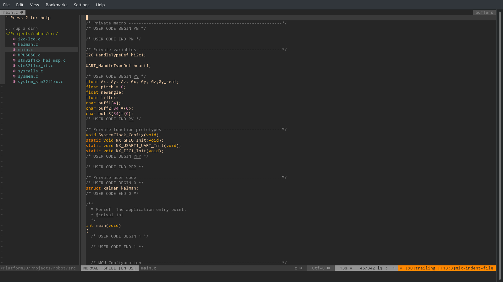

# Arch user dotfiles
* These are my first dotfiles for arch linux that running awesome as window manager plus with other widget and ultility
# What are Dotfiles?

* User-specific application configuration is traditionally stored in so called dotfiles (files whose filename starts with a dot). It is common practice to track dotfiles with a version control system such as Git to keep track of changes and synchronize dotfiles across various hosts. There are various approaches to managing your dotfiles (e.g. directly tracking dotfiles in the home directory v.s. storing them in a subdirectory and symlinking/copying/generating files with a shell script or a dedicated tool). Apart from explaining how to manage your dotfiles this article also contains a list of dotfile repositories from Arch Linux users.
# Installation
## Download Nodejs for coc to work
```bash
curl -sL install-node.now.sh/lts | bash
```
## Download all plugins
* First step is to download all the plugin this repo need

For [vim-plug](https://github.com/junegunn/vim-plug):
```
:PlugInstall
```
## Install extension
For [vim-plug](https://github.com/junegunn/vim-plug):
## Install language extension
```
:CocInstall coc-snippets coc-git coc-vimlsp coc-git coc-python coc-java coc-json coc-html coc-cmake clangd
```
* For ```coc-clangd``` neovim needs additional step
```
:CocCommand clangd.install
```
* After installing extensions use checkhealth command for extension entry
```
:checkhealth
```

## Run the script
```
./install.sh
```
