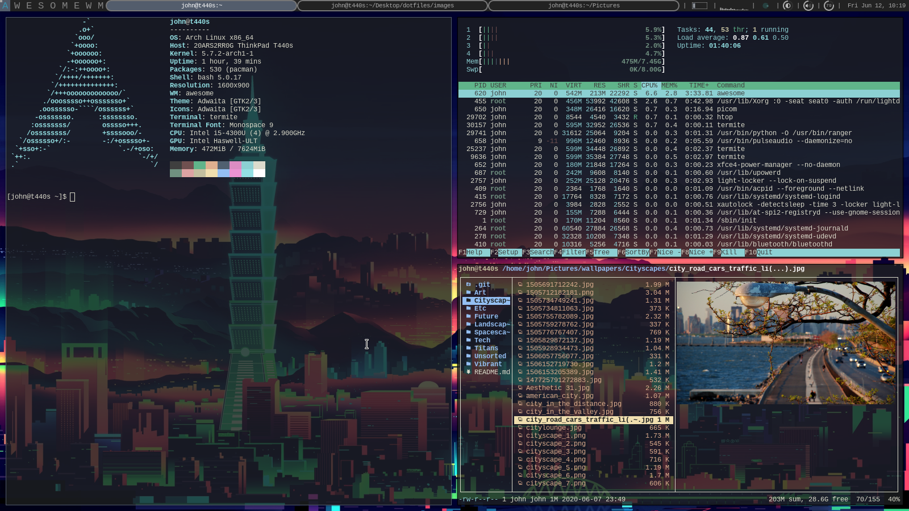

# UNIX user dotfiles
These are my dotfiles for Arch Linux based distribution that I'm been ricing for a couple of months and I would like to share it to the internet  
# What are dotfiles?

Dotfiles are User-specific application configuration is traditionally stored in so called dotfiles (files whose filename starts with a dot). Dotfiles are text-based and they are usually hidden on the system. When an application is launched, it look for it corresponding dotfiles to load the configuration that the user had defined previously like tittle shortcuts, tweaks, and settings. These dotfiles are shareable which mean that one user can use other users dotfiles for their specific application  
# Who Am I?

    I am Ky Nguyen, my friend called me John, I'm an undergraduate who studies engineer. In the summer of 2018, I discovered one of my friends uses Ubuntu on his laptop, and suddenly I decided to give it a try. Since that, I began to distro-hopping to find the distro that I love. Then I found Arch Linux which is a very customizable and light-weighted distro that I've been using ever since.

# Managing your dotfiles
There are many tutorial on the internet that can help managing your own dotfiles, wheather your system are macOS or Linux based, dotfiles works in all UNIX based-OS. A great place to to start is "Your unofficial guide to dotfiles on GitHub." page 
https://dotfiles.github.io/

# Credits
[streetturtle](https://github.com/streetturtle/awesome-wm-widgets) - for the widget

[Wwesome WM](https://awesomewm.org/) - the folks at awesome

[Arch Linux](https://wiki.archlinux.org/) - the Arch Wiki Pages
